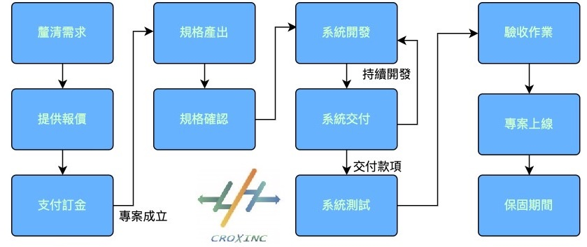
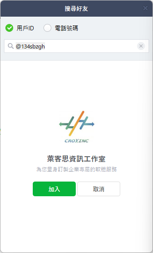
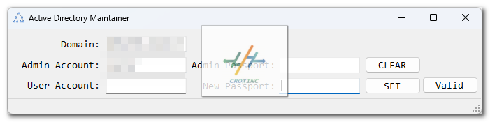
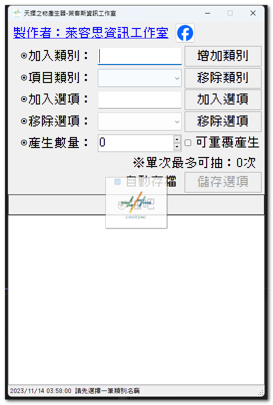
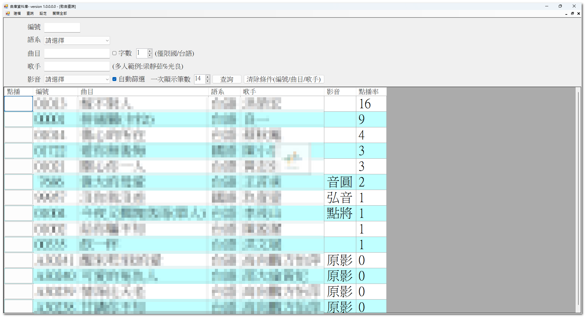
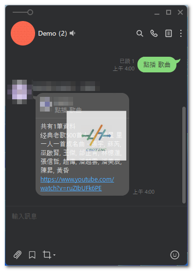

    

    Hi, 我是 Lester ，我是一名專職專案管理以及軟體系統開發者。

### 快速導覽
- <a href='#cooperation'>合作模式</a> 
- <a href='#skill'>專業技能</a> 
- <a href='#contact'>聯絡我們</a> 
- <a href='quote'>報價方式</a>

### 因地制宜的合作模式：
* 若您是公司行號或是獨立製作的團隊：我們會根據您的預算、專案的需求狀況、以及緊急程度，提供不同的協助方式，若需要進一步的暸解，歡迎與我們聯絡討論。
* 若您是前端工程的團隊，需要後端的開發協助，歡迎隨時與我們聯絡合作。

### 我們擁有下列的專業技能，能提供您的公司/專案/功能相關的協助。
* 視窗程式的開發(WinForm - C#/VB)
* 後端的程式開發，以及串接作業(WebAPI)
* 資料庫規劃(MSSQL)
* RPA自動化流程開發(UiPath)

### 專案執行流程如下，雖然有很多的階段，但都是要確保我們所創造出來的專案都是對我們的業主有所效益：

* 釐清需求：會與您暸解專案的範疇，以及相關延伸的內容。
* 提供報價：根據暸解到的內容，我們會根據上述的內容，提供報價給您，待您暸解專案的執行方向，以及內容初步是否對焦後，我們就可以進行下面的流程了。
* 支付訂金：這個步驟表示，您已對後續要執行的內容有著相當程度的暸解(包含時程、或是專案中各項的討論)，確認後續相關的合作。
* 規格產出：這個階段，我們會將要執行的項目，具體的條列出來，並向您進行說明。
* 規格確認：規格確認無誤的時候，我會提供規格確認的文件給您們，以確認我們雙方針對要執行的內容是一致的。
* 系統開發：我們將根據議定的規格內容進行系統的開發。
* 系統交付：專案具有一定規模的時候，我們會有階段性的交付時程，期間我們會共同約定相關的時間。

        ※上述可能會因為專案的規模，分階段提供。
* 系統測試：交付的功能，我們也會給予您時間進行同步的測試，以確保專案無虞。
* 驗收作業：於所有的功能交付完畢，您也進行測試完畢，我們會進行正式上線前的作業，以確保我們的目標已經達成了。
* 專案上線：驗收作業完畢後，將收取尾款，表示我們已經完成了此項作業。
* 保固期間：根據每個專案，我們會與您製訂保固的時間，期間我們會針對專案內的項目，盡可能提供地協助。
* 額外需求：專案進行的途中，會有其他衍伸的議題出現，雖然我們會盡可能完善方案，但可能有各項因素，例如制度變更，或是變動了一些項目，這些不在原本評價的範圍內，可能就要進一步討論處理方式，甚至是需要另外進行專案變更，甚至要重新報價，再麻煩要注意這件事喔。

        ※上述內容，有可能依溝通的過程中，會有所變動，但基礎會是以這個為準

### 報價方式：
* 依專案的規模進行報價。

        使用的人數，耗費的時間，是否需要趕工…等等的考量因素。(每個專案都是為您的企業量身訂製的)

* 售後維護合約。

        每個專案在保固期結束後，您可以決定是否付費使用我們為您提供的服務。

### 可否提供發票開立：
* 可以的，我們是有提供發立發票的作業。

### 您可以透過下列方式連絡到我：
* Facebook粉絲專頁： [萊客思資訊工作室的Facebook](https://www.facebook.com/croxinc.studio) , 或是輸入連結：https://www.facebook.com/croxinc.studio

* Instagram: [萊客思資訊工作室的Instagram](https://www.instagram.com/croxinc.studio)，或是輸入連結：https://www.instagram.com/croxinc.studio
* 郵件： croxinc.studio@gmail.com
* LINE@：@134sbzgh (打開加入好友的頁面，並輸入 @134sbzgh )

### 相關經歷：
* 上市/櫃公司：進行專案管理、系統規劃/開發，跨系統的介接。
* 接案的公司，進行接案，以及公司內的產品維護/開發。

### 曾執行過的專案(僅列部份)
#### WebAPI：
* Linebot聊天機器人、
* Youtube(Google API)串連
#### Windows視窗應用程式：
* KTV點播系統
* 訂單管理系統
* 履歷追蹤系統
* 庫存管理系統
* 客戶關係管理系統
* 租賃管理系統
* 各項抽獎流程系統
#### 遊戲開發：
* Unity遊戲系統開發
#### RPA自動化流程
* 特定產品每日抓取彙整報表作業
* 匯率自動更新作業(SAP/特定網站)
* 跨系統整合作業(BI/WHS)
* 自動通知作業
* 資料清洗作業
* AD登入密碼定期變更作業。

